# 第一章 交换概论

## 什么是交换

* 无交换的多点间通信：
	* 全互连方式需要$C_n^2=N(N-1)/2$线对
	* 每个终端配置一个多路选择开关
	* 增加第 N+1 个中断操作复杂：增加 N 对线路、更换所有多路选择开关
* **交换（switching）**就是在通信网上，负责在通信的源和目的终端之间建立通信信道、传送通信信息的机制（控制）。
* 交换系统的构成：终端设备、传输设备、交换设备

### 三对基本概念

* 信息传送：面向连接工作方式（物理连接、逻辑连接）——无连接工作方式
* 时分复用：同步时分复用——统计（异步）时分复用
* 带宽分配：固定带宽分配——动态带宽分配

#### 信息传送

* 面向连接工作方式：连接建立——信息传送——连接释放

* 无连接工作方式：边寻址边传递讯息

#### 时分复用

* 同步时分复用：

	* 位置化信道：依据信号在时间轴上的位置来区分每一路信号（逻辑信道），无信息传送时也占用信道。
	* 每帧定长、子信道信息流速率恒定。

	e.g. 30/32路 PCM 系统

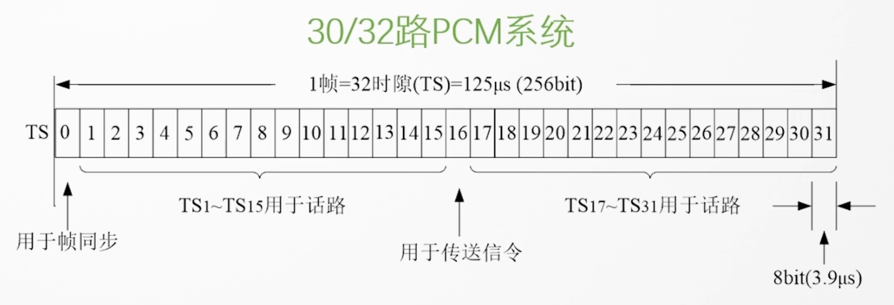

> PCM的意思就是脉冲编码调制，现在的数字传输系统都是采用PCM体制。PCM设备是利用2M线路传输的，所以PCM链路也可以理解为是2M线。
>
> E1就是采用PCM技术的，具体说是PCM30/32，总共32个时隙。除了0和16时隙用于传输其它数据外，1-15和17-31路时隙均可以传输话音或其它有效数据，每路速率为64K，所以一条E1就是2048kbps，即2M。
>
>  PCM线可以称为同轴电缆、双绞线或为2M线。2M线可以是电信上租用的，也可以是光端机上输出的。
>
> 2M线：在通信行业通常将SYV类射频同轴电缆叫做2M线。
>
> 
>
> 欧洲的30路脉码调制PCM简称[E1](https://baike.baidu.com/item/E1)，速率是2.048Mbit/s 。
>
> 中国采用的是欧洲的E1标准。
>
> E1的一个时分复用帧（其长度T=125us）共划 分为32相等的时隙，时隙的编号为CH0\~CH31。其中时隙CH0用作帧同步用，时隙CH16用来传送信令，剩下CH1\~CH15和CH17\~CH31 共30个时隙用作30个话路。每个时隙传送8bit，因此共用256bit。每秒传送8000个帧，因此PCM一次群E1的数据率就是 2.048Mbit/s。
>
> 1、一条[E1](https://baike.baidu.com/item/E1)是2.048M的链路，用PCM编码。
>
> 2、一个E1的帧长为256个bit,分为32个时隙，一个时隙为8个bit。
>
> 3、每秒有8k个E1的帧通过接口，即8K*256=2048kbps。
>
> 4、每个时隙在E1帧中占8bit，8*8k=64k，即一条E1中含有32个64K。
>
>  
>
>  总结：
>
> E1(电信标准)： 采用同步时分复用技术将30个语音信道和2个控制信道复合在一条2.048Mbit/s的高速信道上。
>
> E1线≈2M线≈PCM线，都是支持欧洲的30路脉冲编码调制PCM，线路速率是2.048Mbit/s的同轴电缆。
>
> PCM设备是利用2M线路传输的，所以PCM链路也可以理解为是2M线。

* 统计（异步）时分复用：
	* 标志化信道：标志码表示哪路信息。
	* 分组长度可变或不可变，分组头用于定界。
	* 统计复用提高信道利用率。

#### 带宽分配

* 固定带宽分配
* 动态带宽分配

## 各种交换方式

CTM（Circuit Transfer Mode，电路传送模式）：电路交换，多速率电路交换、快速电路交换

PTM（Packet ……，分组传送模式）：分组交换、帧交换、帧中继

ATM（Asynchronous ……，异步传送模式）：ATM交换、IP交换、光交换、MPLS、软交换、IMS

### 电路交换

#### 电路交换（CS）

电话通信中信息的传送方式：**公共交换电话网（Public Switched Telephone Network，PSTN）**

每一路能提供64k速率。

电路交换的特点

* 信息传送的最小单位是时隙

* 面向连接的工作方式（物理连接）
* 同步时分复用（固定带宽分配）
* 无差错控制机制（实时性强）
* 对通信信息不作处理（透明传输）
* 流量控制基于呼叫损失制

适合实时性、恒定速率的业务。

#### 多速率电路交换（MRCS）

采用同步时分复用方式，将多个64k信道捆绑起来形成一个速率更高的信道。不同速率的信道经过分路在不同的交换网络中进行交换。

缺点：速率是事先定好的，而且速率类型不能太多，否则控制和交换网络会非常复杂。

#### 快速电路交换（FCS）

只在信息需要传送时才建立物理连接，提高了带宽利用率，但控制复杂，灵活性不如帧中继和ATM交换。

### 分组交换（PS）——存储转发

传输时延+存储时延+处理和排队时延

* 报文交换

* 分组交换：在报文交换存储转发的基础上使用分组减小时延
	* 虚电路（virtual circuit）：
		* 面向连接。
		* 使用**逻辑子信道（Logic Channel Number，LCN）**，在交换节点路由表上记录出入端口。
		* 应用：PSPDN 网络
	* 数据报：
		* 无连接。
		* 使用标示来区分数据报，可变速率。

分组交换的特点：

* 信息传送的最小单位是分组

* 面向连接（逻辑连接）方式和无连接方式。
* 统计时分复用，动态分配带宽。
* 有差错控制机制。
* 对通信信息作处理。
* 流量控制基于呼叫延迟制。

|            | 虚电路             | 数据报                 |
| ---------- | ------------------ | ---------------------- |
| 分组头     | 简单（逻辑信道号） | 复杂（详细的选路信息） |
| 选路       | 虚连接表           | 每个分组独立选路       |
| 分组顺序   | 有序               | 可能失序               |
| 故障敏感性 | 敏感               | 可靠性高               |
| 应用       | 连续数据流         | 询问/响应              |

为什么数据通信网采用分组交换方式？

——可靠性要求高、可变速率的数据业务（实时性相对电路交换较差）

### 帧交换（FS）

分组交换基于X.25协议，包含物理层、数据链路层和分组层——导致信息通过交换节点的延迟增加，无法满足高速数据通信。而帧交换协议栈只有物理层和数据链路层，加快处理。

### 帧中继（Frame Relay）

在帧交换的基础上对二层协议进一步简化，二层没有流量控制和重发功能。

帧中继和帧交换的前提条件：

* 高带宽、高质量的传输线路的大量使用（光纤），是的简化差错控制和流量控制成为可能。
* 终端系统日益智能化，将纠错功能放在终端完成，网络只完成公共的核心功能，提高网络效率。

### ATM交换

专门为B-ISDN（宽带综合业务数字网）开发的技术。间距分组传送和电路传送的有点。

特点：

* 固定长度的信元和简化的信头：
	* ATM中信息传送的最小单位是信元（53byte），包括信头（5byte）、信息域或者净荷（48byte）。
	* 简化了虚连接标志、优先级标志、净荷类型标志等字段。
	* 仅对信头做差错检验。
* 采用了异步时分复用：将时间划分为等长的时间片、靠信头来区分不同路。
* 采用面向虚连接的工作方式：分为虚通道连接（VPC）和虚信道连接（VCC）

### IP交换

* 叠加模型：IP层运行于ATM层之上

* 集成模型（IP交换、Tag交换、MPLS）：只需要IP地址和IP选路协议，但需要专用控制协议完成3层选路到2层直通交换机构的映射。

优点：将IP选路的灵活性和健壮性与ATM交换的大容量和高速度结合起来。

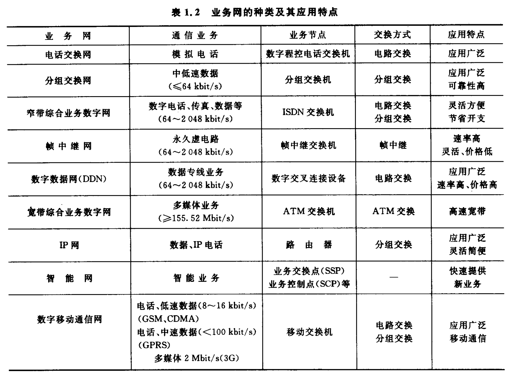

## 交换系统基本结构

* 互联技术：交换网络的拓扑结构、选路策略、控制机理、多播方式、阻塞特性、故障防卫
* 接口技术：模拟用户接口、数字用户接口、模拟中继接口、数字中继接口
* 信令技术：用户信令、局间信令
* 控制技术：控制系统的结构方式、多处理机结构

# 第二章 交换网络

## 交换网络的构成

* 交换系统中，完成**交换**这一基本功能的部件就是**交换网络**或**交换结构（Switching Fabric）**。
* 交换网络是由若干**交换单元**按照一定的**拓扑结构**和**控制方式**构成的，交换单元是最基本部件。

## 交换单元

### 交换单元的基本概念

**输入控制：控制一条输入线与每一条输出线的交叉点的开启与闭合（读取当前时隙CM中i号输入线对应存储器的内容j，开启j号输出线）**

**输出控制：控制一条输出线与每一条输入线的交叉点的开启与闭合**

交换单元的分类：

①方向

* 有向交换单元：交换单元具有固定的入线与出线：
	* M$\times$N 有向交换单元
* 无向交换单元：每条线既可入也可出：
	* N 无向交换单元
	* K$\times$L 无向交换单元

②数量

* 集中型（M>N）、扩散型（M<N）、连接型（M=N）

③按出入线之间是否共享单一通路

* 空分交换单元（开关阵列）
* 时分交换单元（共享总线）

④信号

* 数字交换单元（DSE）
* 模拟交换单元

### 交换单元的基本特性

#### 交换单元的连接特性

* 交换单元连接特性的描述方式：
	* 集合描述方式
	* 函数描述方式（排列、图形、二进制函数）
* 常见的连接方式：
	* 直接连接
	* 交叉连接
	* 蝶式连接
	* 均匀洗牌连接
	* 间隔交叉连接

#### 交换单元的性能

* 容量：所有入线可以同时送入的总信息量
* 接口：信号形式、速率、信息流方向
* 功能：点到点、点到多点
* 质量：完成交换动作的速度、任何情况下是否能完成指定连接、信息经过交换单元是否有损伤（时间、语义）

### 开关阵列

在每条入线和每条出线直接都各自接上一个开关，构成开关阵列。

* 开关的位置：入、出线交叉点
* 开关的表示：$K_{ij}$（i 为入线，j 为出线）
* 开关的状态：通、断
* 开关的种类：单向、双向

实现：全连通交换单元、部分连通交换单元、多路选择器……

* 开关阵列的特性：
	* 容易实现广播功能
	* 从入线到出线具有均匀的单位延迟时间
	* 控制信号简单
	* 适合构成较小的交换单元（开关数反映了实现的复杂度和成本高低）
	* 交换单元的性能依赖于所使用的开关

* 实际的开关阵列：
	* 继电器
	* 模拟电子开关
	* 数字电子开关

### 空间（空分）交换单元

也叫**空间接线器（Space Switch）**，简称 S 单元或 S 接线器。

* 构成：
	* 交叉点矩阵（开关阵列）
	* 控制存储器（CM，Control Memory）
* 功能：输入输出线之间的空间交换
* S 接线器所含 CM 数量等于入（出）线数
* 每个 CM 含有的存储单元个数等于入（出）线上的复用时隙数
* 每个存储单元为 m 位 bit，且满足$N \le 2^m$，其中 N 为接线器的入（出）线数
* CM 具有输入控制方式与输出控制方式。
* 空间交换单元的基本特点：
	* 只完成空间交换，不进行时隙交换
	* 空间接线器按时分方式工作
	* 输<u>出</u>控制方式易于实现多播

### 时间（时分）交换单元

#### 时分交换单元的一般构成

分为：共享存储器型交换单元、共享总线型交换单元。

共享存储器型：共 2N 个出入线缓存。入线缓存控制读出、出线缓存控制写入

共享总线型：总线按照时隙轮流分配给入线控制部件和出线控制部件使用

$kNV=B/T$（N 为入线数、V 为入线速率、B 为每时隙传送比特数、T 为时隙长度，k 为时隙分配因子）

#### 时间接线器的构成

* T 接线器
	* 话音存储器（SM，Speech Memory）：暂存话音的数字编码信息
		* 存储单元个数等于 PCM 线路每帧时隙数；每单元至少 8bit（一路话音）
	* 控制存储器（CM，Control Memory）
		* 存储单元个数等于SM；每单元至少$log_2n（n 为时隙数）$比特

#### 时间接线器输出控制方式

顺序写入、控制读出

* SM：前半周期顺序写入话音、后半周期从地址读出话音

* CM：前半周期顺序写入控制地址、后半周期控制读出话音

缺点：复用级别越高，对控制电路要求越高，无法达成很大规模；时隙转换延迟不定。

### 交换网络

#### 基本概念

交换网络是由若干个交换单元按照一定的拓扑结构和控制方式构成的网络。

三要素：交换单元、拓扑连接和控制方式。

* 单级交换网络：由一个或多个位于同一级交换单元构成的交换网络，信息从交换网络**入线到出线只经过一个交换单元**，并且**同一级多个交换单元入线和出线之间可建立连接**。
* 多级（k 级）交换网络：
	* 所有入线都只与第一级连接。
	* 所有第1级交换单元都只与入线和第2级连接。
	* 所有第2级交换单元都只与第1级和第3级连接。
	* 所有第k级交换单元都只与第k-1级和出线连接。

* 有阻塞交换网络：存在对同一公共资源（内部竞争、出线竞争）的争抢。
	* 
* 无阻塞交换网络：
	* 严格无阻塞交换网络：任何时刻都可以在交换网络中建立一个连接（只要该连接起点、终点是空闲的）而不影响已建立的连接。
	* 

#### CLOS 网络

#### TST 网络

#### DSN 网络

#### BANYAN 网络

# 第三章 数字程控电话交换与电话通信网

## 电话交换系统

### 电话交换机整体结构

----

----

### 话路部分

#### 模拟用户接口与用户模块

----

----

用户电路功能（BORSCHT）：

* 馈电（Battery feeding）：-48V
	* 
* 过压保护（Overvoltage protection）：二极管用于钳制电压，无论外线电压高于或低于内线，都会由二极管钳制内线为 48V，R 为热敏电阻，可自行烧毁。
	* 
* 振铃控制（Ring control）：CPU 发送振铃控制信号控制继电器通断开始振铃，用户摘机后发出振铃开关发出截铃信号通知 CPU 停止振铃。
	* 
* 监视（Supervision）：通过电阻的直流压降得知用户是否摘机。
	* 
* 编译码和滤波（CODEC&filters）：对模拟信号进行编码、对数字信号进行解码；为避免混叠失真、50Hz 干扰、3400Hz 以上频率分量，进行滤波。
* 混合电路（Hybrid circuit）：在用户话机的 2 线双向信号和 PCM 的 4 线单向信号之间进行 2/4 转换。（发生在编码之前和译码之后）
* 测试（Test）：
	* 

#### 用户模块

* 用户电路：每条用户线有一个用户电路，完成信号采集、动作驱动、话音传输功能。
* 交换电路（用户及交换网络）：用户即交换和话务集中。
* 收号器：接收用户的 DTMF 号码。
* 扫描存贮器：接收用户电路扫描信息，送给用户处理机。
* 信号分配存贮器：接收用户处理机对各用户电路的指令，控制用户电路继电器动作。
* 用户处理机：与中央处理机协调控制用户电路和交换电路的工作。
* 通信电路（信号提取插入）：收发用户处理机与中央处理机间通信的信息。
* 网络接口：把用户的话音和处理机的通信消息合并在一起送到中央级数字交换网络。

#### 数字中继接口

* 内部 NRZ 码与外部 HDB3 码之间的转换
* 时钟提取和同步（位同步、帧同步、复帧同步）
* 信令的插入提取

----

----

数字音频信号的产生、发送和接收

----

#### 交换网络与话路连接

* **此图分路器出线箭头方向反了！参考图 3.18**
* PCM 信号采用串行码，T 接线器是 8bit 并行写入或读出。
* 复用器的功能：
	* 信号的串并变换。
	* 将多路低速信号进行时分复用，形成高速时分复用信号。
* 分路器：
	* 信号的并串变换。
	* 将高速的时分复用信号进行分路，形成多路低速信号。

----

----

* 如果复用器输入线数为$n$，那么$i$号输入线上的$TS_j$在复用变换器串并变换及复用后，在输出线上的时隙为$ITS_{jn+i}$。

----

* 内部时隙 ITS 与外部时隙 TS 的换算关系：总共有$m$条 HW，第$i$条 HW 上 $TS_j$的 ITS 号 =$j \times m + i$。

----

* 话路建立：
	* 用户 A 呼叫用户 B：用户级出线$TS_{8}$经过$M_0$交换为$ITS_{16=2*8+0}$，选择交换时隙$ITS_{20}$；
	* 用户 B 建立到用户 A 的连接：采用反向法（半帧法）计算，由$ITS_{20}$，T 接线器输入信号每帧为 64 时隙，半帧为 32，故 20+32=52，所以 B 到 A 的连接选择$ITS_{52}$。

### 软件部分

* 任务：控制交换机的运行
	* 呼叫处理
	* 管理与维护
	* 运行安全与保护
	* 网络管理等。
* 要求：
	* 实时性
	* 并发性
	* 业务不间断性
	* 通用性

#### 呼叫处理原理

##### MSC、FSM 与 SDL

* MSC（Message Sequence Chart）消息流图：用于描述系统功能接口。
* FSM（Finite-State Machine）有限状态自动机和 EFSM（Extended FSM）扩展有限状态自动机：用于描述系统功能。
* SDL（Specification and Description Language）规范与描述语言：用于系统功能的设计。

用 SDL（Specification and Description Language） 图表示呼叫处理过程：SDL 主要应用于电信领域，为描述复杂度实时系统而特别设计。比起 EFSM（扩展的有限状态机），可以更好地表达功能部件之间的通信关系和定时器功能。

* 本局呼叫的处理过程简图（省略了细节的分析判断及用户听忙音状态之后呼叫处理行为的描述）

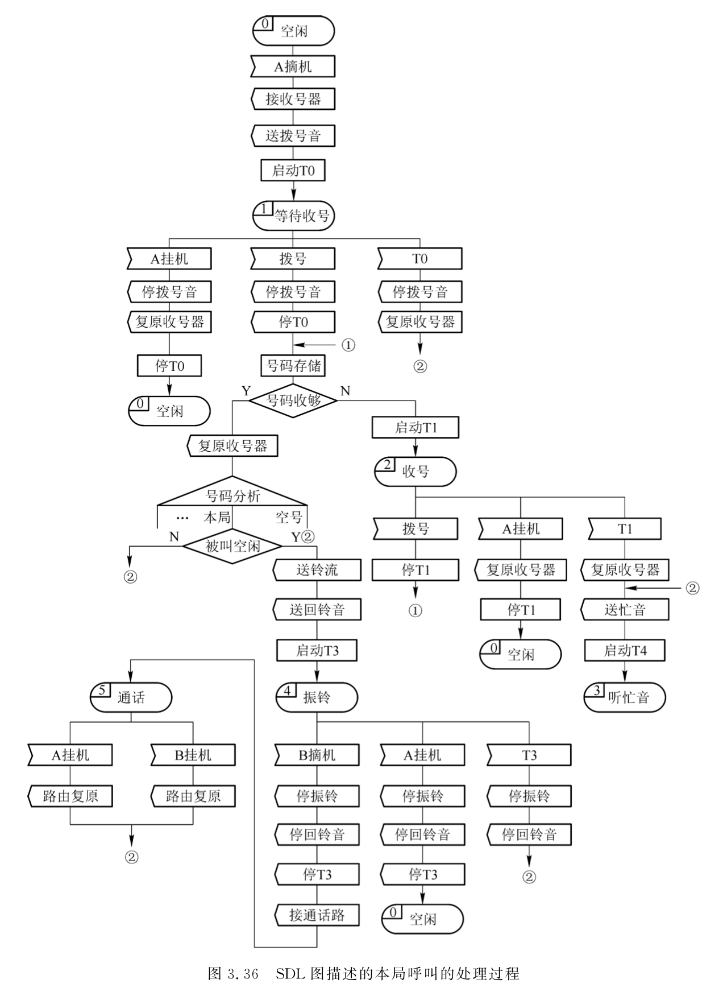

* 呼叫处理过程：
	* 输入处理（数据采集）：识别并接收外部的处理请求和信号，生成事件。
	* 分析处理（数据处理）：根据状态、输入事件、条件，分析判定下一步的工作。
	* 任务执行和输出处理：发布命令，控制动作。
* 用户线扫描：
	* 扫描目的：识别摘机（直流回路接通，1-0）、挂机（直流回路断开，0-1）事件。
	* 扫描周期：100~200ms。
	* 群处理扫描、逐次展开法、表格驱动：**提高效率**。

* 摘挂机识别原理

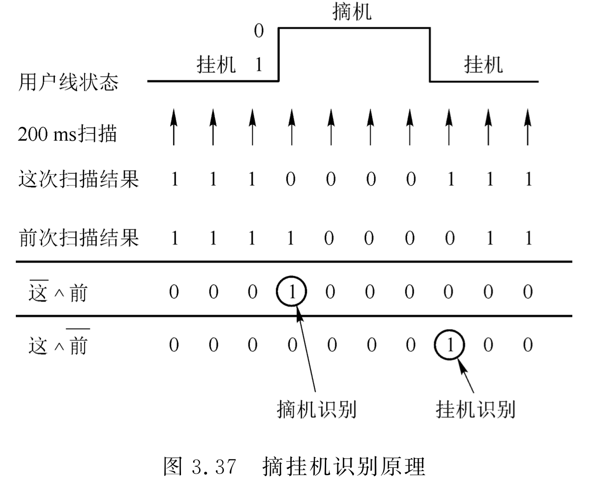

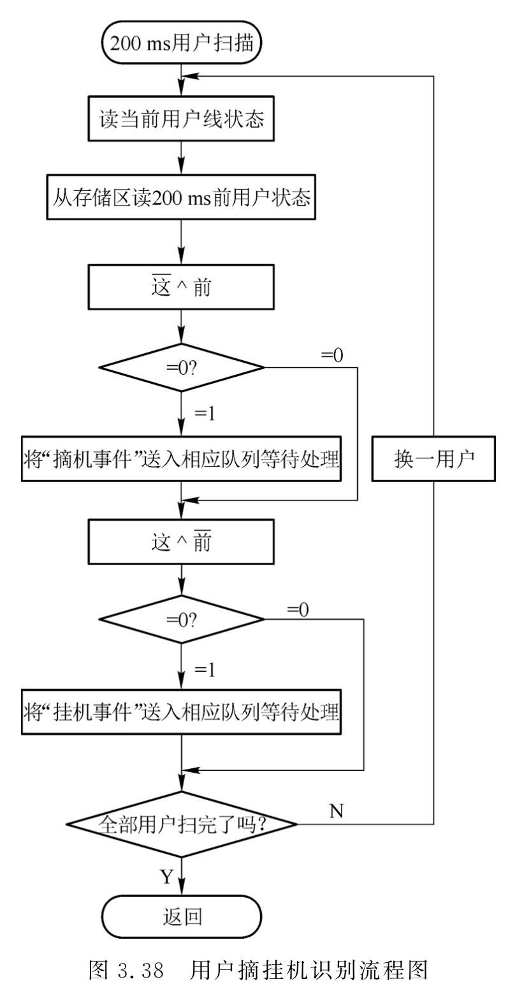

* 脉冲拨号与位间隔识别识别原理

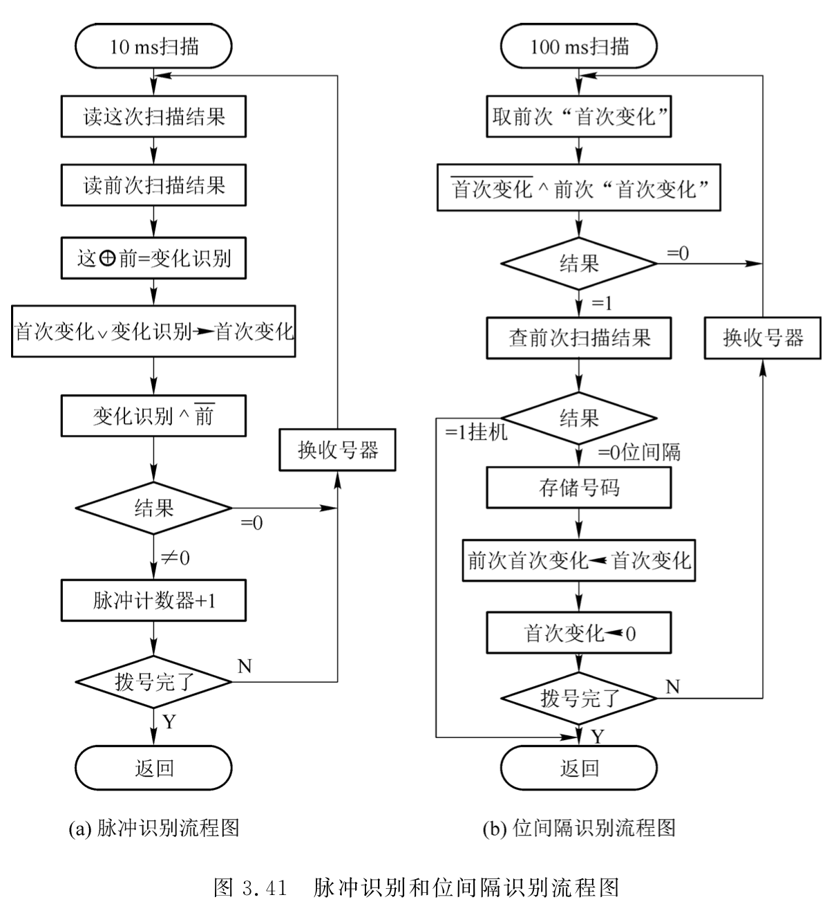

* DTMF 号码接收原理

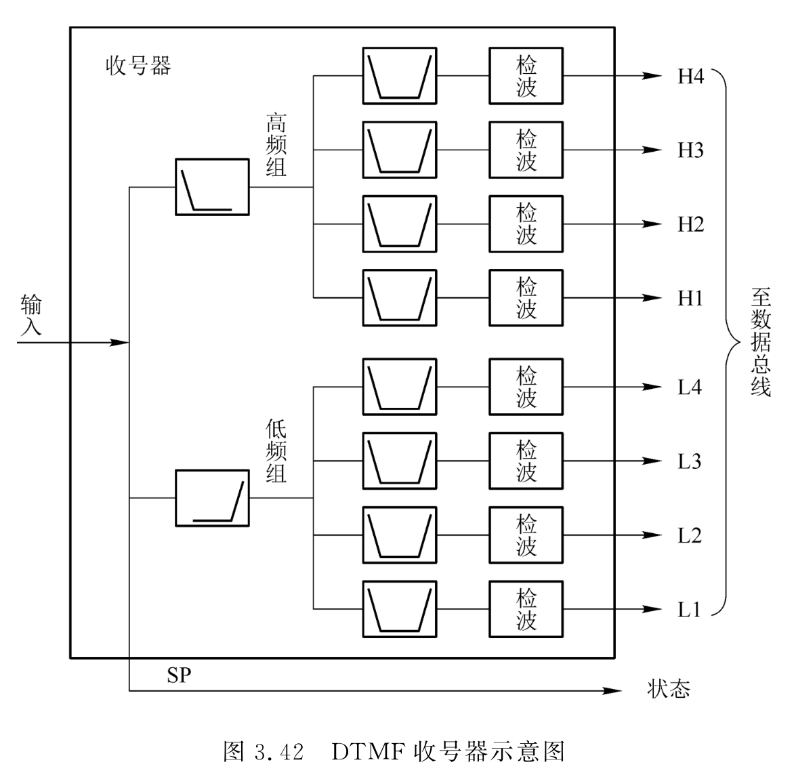

* 
* 分析处理：状态分析、数据分析（去话分析、号码分析、来话分析）

* 状态分析：（二维数组表、多级表）

* 去话分析

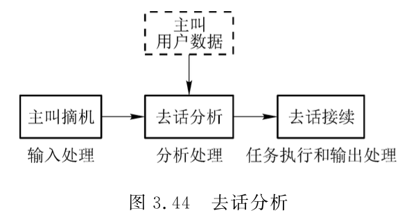

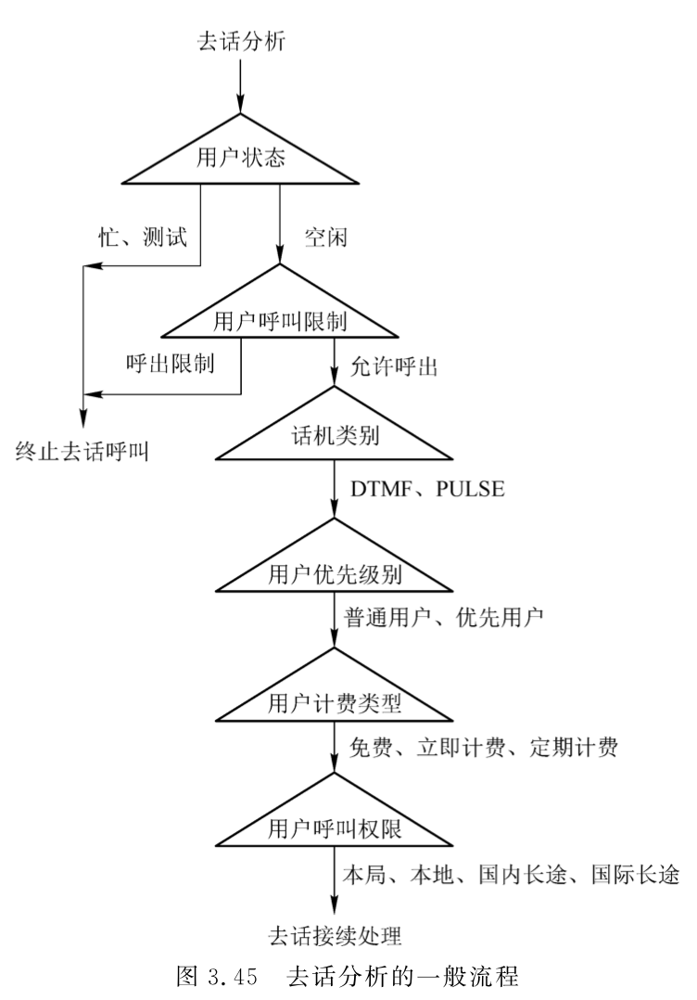

* 号码分析

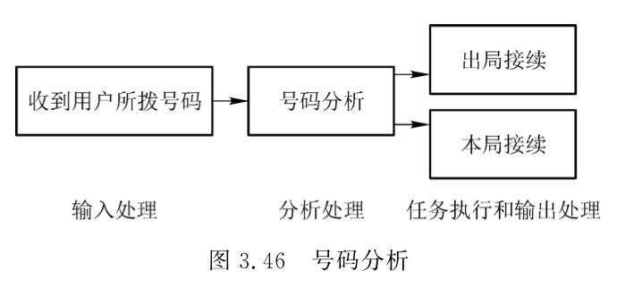

* 来话分析

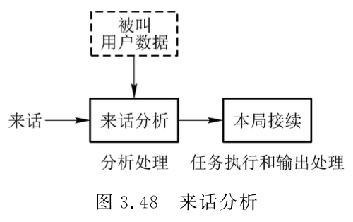

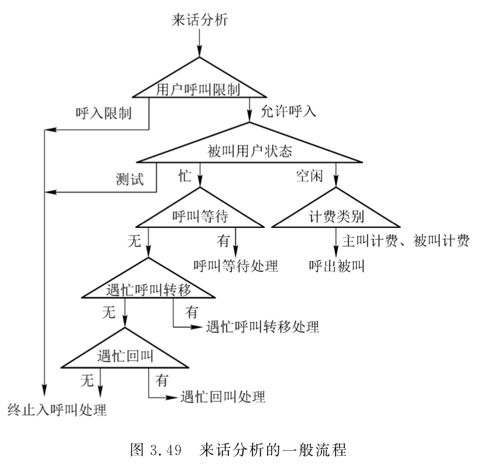

#### 任务分级与调度

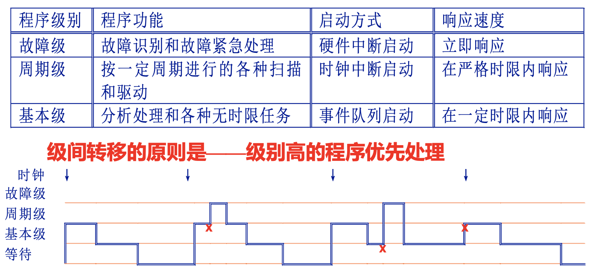

* 周期级调度：
	* 单任务操作系统：时钟中断+时间表调度。
	* 实时多任务操作系统：设置任务周期，用操作系统的调度机制调度。
* 基本级调度：
	* 单任务操作系统：事件队列调度。
	* 实时多任务操作系统：事件队列、信箱等机制驱动。
* 表格驱动（时间表调度）：

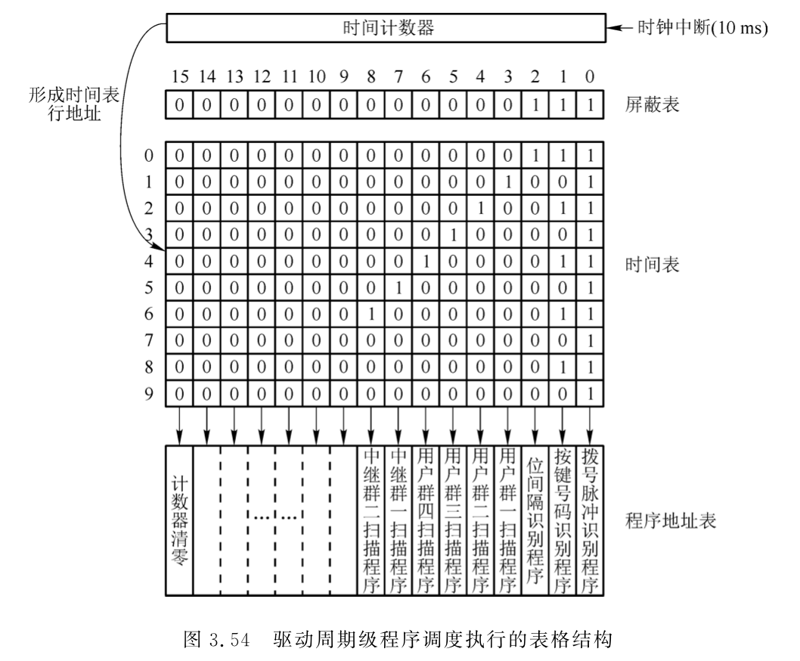

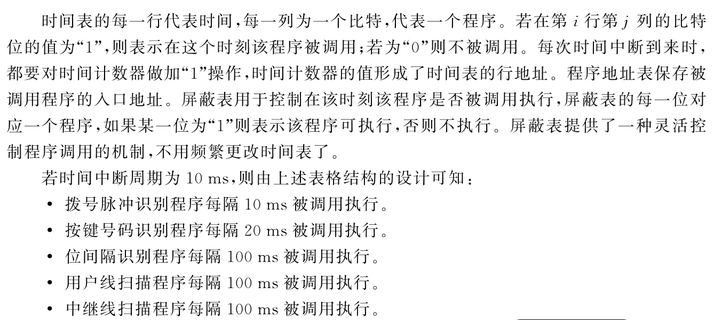

#### 呼叫处理能力BHCA

* 在保证规定的服务质量标准的前提下，控制部件(处理机系统)在单位时间内能够处理的最大试呼次数。以“最大忙时试呼次数”表示，简写BHCA。
* BHCA 计算模型：$t = a + b N$
	* t（系统开销）：时间资源的占用率。
	* a（固有开销）：与呼叫次数（话务量）无关的系统开销，如任务调度和扫描开销。
	* b：处理一次呼叫的平均开销。
	* N：呼叫次数。
	* bN（非固有开销）：处理所有呼叫的系统开销。
* 例题：

* 过负荷控制：到达的话务符合超过交换局的设计能力时，称为过负荷状态。
	* 过负荷控制要求：话务负荷超过设计能力 50%时，保证处理不低于90%设计能力的试呼。
	* 过负荷控制方法：将呼叫源分成不同等级，限制低级源的呼叫，优先高级源的呼叫。
	* 

### 系统架构设计与控制方式

# 第四章 分组交换

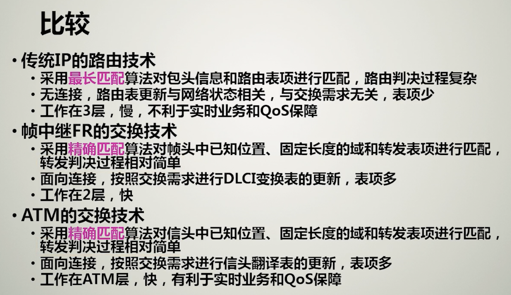

## MPLS

在多种第二层协议上进行标记交换，将第二层和第三层有机结合。

核心思想：**边缘路由，核心交换**：边缘路由保持与现有协议兼容，增强核心网络交换速度

LSP：Label Switched Path标记交换路径，类似虚电路

FEC：Forward Equivalence Class前转等价类，灵活按照多种方式划分，相同FEC的包具有相同Label，走相同LSP

LIB：Label Information Base标记信息库，保存转发Labeled分组所需要的信息。

Ingress LER：Ingress Label Edge Router入口边缘路由器，为每个FEC生成Label，映射到LSP下一跳的标记。对入口IP分组进行分类，确定FEC

LER：根据FEC查询LIB得到下一跳Label，将Label插入IP包头，从相应端口发送。

LSR：Label Switch Router，维护LIB、完成标记置换。

Egress LER：去掉Label还原成普通IP包继续转发。

### 标记分配协议LDP

* 发现相邻的LDP对等体：使用UDP广播，发现相邻LSR
* 建立LDP会话：相邻LSR建立TCP连接，建立LDP会话
* 建立LSP：下游LSR分配标记并沿着LDP会话通知上游LSR

### 主要特点

* 标记置换：将2层的交换速度带到3层
* 控制平面与转发平面分离：便于采用新的路由协议和交换技术
* 通过标记堆栈实现多层次的转发：提高可扩展性

# 第五章 信令与协议

定义：各个设备间传输的控制信号和规约称为信令。

## 七号信令网3层

HSTP高级信令转接点

LSTP低级信令转接点

SP信令点

## No.7信令结构

* MTP：消息传递部分
	* MTP1——物理层
	* MTP2——数据链路层
	* MTP3——网络层一部分
* SCCP：信令连接控制部分——网络层一部分
* UP：用户部分——传输层、会话层、表示层、应用层
	* ISUP：综合业务数字网部分
	* TUP：电话用户部分
	* DUP：数据用户部分
	* TCAP：事务处理能力部分
		* INAP
		* OMAP
		* MAP

### No.7信令单元基本格式

消息信令单元MSU（Message Signaling Unit）：运载高层（用户部分或信令网管理功能）产生的信令消息。

链路状态信令单元LSSU（Link State……）：用来传送链路状态信息。

插入信令单元FISU（Filled-In……）：在无MSU和LSSU时发送。

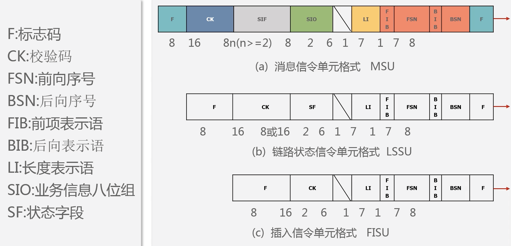

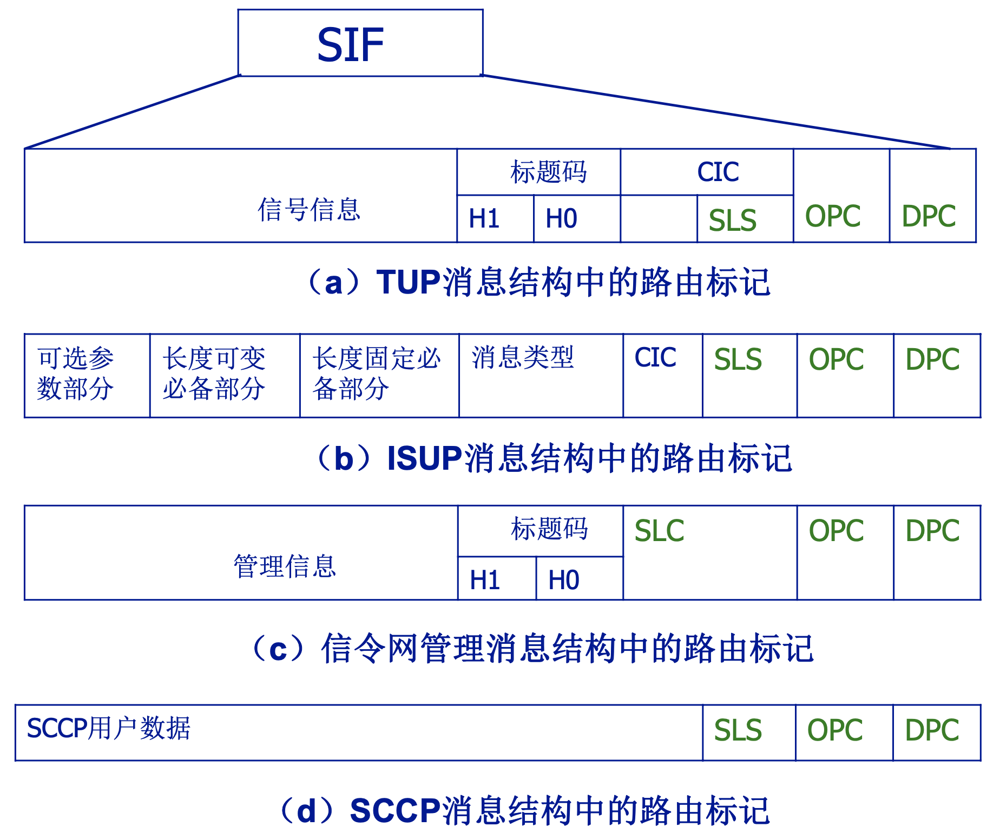

* MSU信令的SIF信息字段中开始位置是路由标记（Routing Label），分为：

	* DPC：目的信令点编码
	* OPC：源信令点编码
	* SLS：信令链路选择码

	路由标记供MTP3级进行消息寻址和路由。国内的信令点编码24bits，国际14bits。

* 电话用户部分TUP处理MSU信令中SIF子段的CIC、H0H1、信令信息：

	* CIC标记话路时隙
	* H0H1是标题码
	* 信令信息传递消息参数

信令工作方式：

* 直联工作方式：SP和SP之间的信令消息通过直接相连的信令链路传送。
* 准直联工作方式：SP和SP之间的信令消息通过（STP转发）预先指定的多条串接的信令链路传送。
* 非直连工作方式：不预先指定，随机转发（复杂，No.7未采用）

## 例题

No.7信令网中，SPA与SPB没有直达的信令通路， 信令消息通过STPC转发。现在SPA要与SPB交互电话呼叫的信令消息，画出相关信令设备的信令协议栈。

