# 一	概论

## 交换的概念

在通信网上，在通信源点和目的点之间建立通信通道，并传送信息的机制。

## 通信网（三要素）

* 交换设备：包括各类交换机和交叉连接设备。

* 传输设备：包括用户线路、中继线路、信号转换设备。（如：双绞线、电缆、光缆、基站无线收发设备、光电转换器、卫星、微波等）

* 终端设备：包括电话机、智能终端、智能外设等用户终端设备。

## 交换方式的特点

### 电路交换

电话通信中信息的传送方式：**公共交换电话网（Public Switched Telephone Network，PSTN）**，每一路能提供64k速率。

电路交换的特点

* 信息传送的最小单位是时隙：每个时隙采样8bit，采样率8kHz，每路通信速率64kbps。

* 面向连接的工作方式（物理连接）。
* 同步时分复用（固定带宽分配）。
* 无差错控制机制（实时性强）。
* 对通信信息不作处理（透明传输）。
* 流量控制基于呼叫损失制。

适合实时性、恒定速率的业务。

### 分组交换

机制——存储+转发。

分组交换的特点：

* 信息传送的最小单位是分组：由分组头、用户信息构成，分组头含有选路和控制信息。
* 面向连接（虚电路）方式和无连接（数据报）方式。
* 统计时分复用，动态分配带宽。
* 有差错控制机制：CRC校验、重发等（设于第二层和第三层协议中）。
* 信息传送不具有透明性：对通信信息作处理，如拆分、重组等。
* 流量控制基于呼叫延迟制。

适用于突发、对差错敏感的数据业务。

|            | 虚电路             | 数据报                 |
| ---------- | ------------------ | ---------------------- |
| 分组头     | 简单（逻辑信道号） | 复杂（详细的选路信息） |
| 选路       | 虚连接表           | 每个分组独立选路       |
| 分组顺序   | 有序               | 可能失序               |
| 故障敏感性 | 敏感               | 可靠性高               |
| 应用       | 连续数据流         | 询问/响应              |

### 各类交换方式的基本信息交换单元

| 交换类型 | 基本信息交换单元 |
| -------- | ---------------- |
| 电路交换 | 时隙             |
| 报文交换 | 报文             |
| 分组交换 | 分组             |
| 帧中继   | 帧               |
| ATM交换  | 信元             |

## 复用技术

### 同步时分复用

* 用于电路交换。
* 采用位置化信道：
	* 根据数字信号在**时间轴**上的位置区别各路。无信息传送时，也会占用信道。
	* 每帧定长。
	* 信号经过复用器和分路器的时延低（1~2帧）。

### 统计时分复用

分为分组化时分复用、异步时分复用。

* 用于分组交换、ATM交换。

* 采用标志化信道：使用分组头的标志区分各路通信。

#### 分组化时分复用

* 每个分组前附加标志码，标识分组的输出端或传送路径，与时间无关。
* 分组长度可变、分组头定界。
* 统计复用提高信道利用率。具有一定容量的排队存贮器，解决瞬间的出线冲突。
* 传输时延较小且稳定、处理时延与分组大小有关、排队时延与突发流量有关。

#### 异步时分复用

* 位置固定的标志化信道。
* 信元长度固定、插入空信元保持同步。
* 时延较为稳定。

## 连接类型

### 面向连接/无连接

面向连接：

* 无论物理或逻辑连接，通信分为三阶段：连接建立、传送信息、连接拆除。
* 连接建立后，传送的所有信息均沿此路径传送，保证信息有序性。
* 信息传送的时延（比无连接）小。
* 对网络故障敏感。

无连接：

* 没有连接建立过程，边选路边传送。
* 同一通信的信息到达目的地的路径无法预知，不保证信息有序性。
* 信息传送的时延（比面向连接）大。
* 对网络故障不敏感。

### 物理连接/逻辑连接（虚电路）

同：都具有连接建立、传送信息、连接拆除三阶段。

异：物理连接建立一条通信源和目的之间的物理连接通路；逻辑连接没有物理连接，通过在通信连接上的所有交换节点保存选路结果和路由连接关系实现逻辑上的连接。

## 带宽分配

### 固定带宽分配

### 动态带宽分配

见“复用技术”。

## \*交换技术的种类和特点

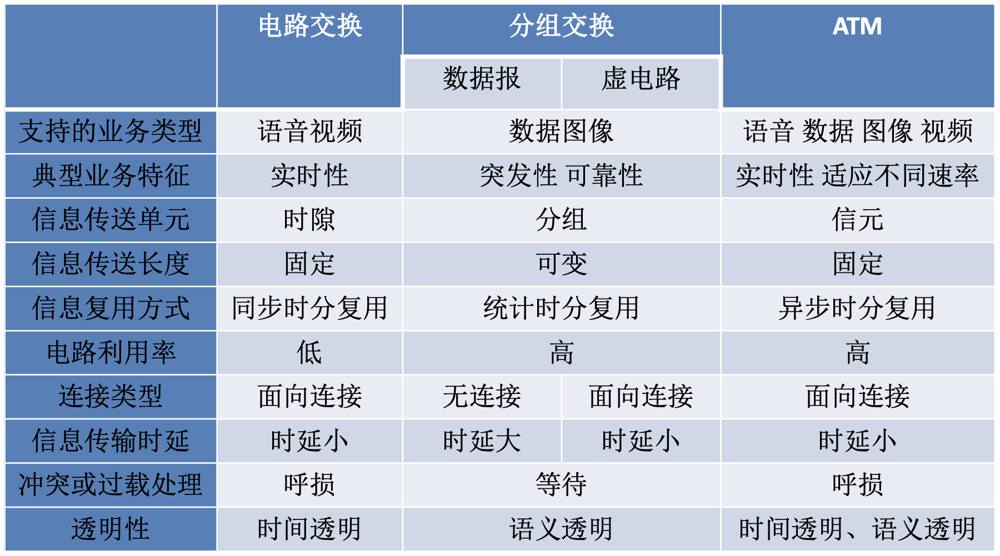

## \*各种常用网络的交换方式

## \*各种常用网络的重要信令/协议

## \*电信交换系统的基本结构

由信息传送子系统和控制子系统组成。

* 信息传送子系统：
	* 交换网络：完成交换，实现任意出线与入线的互联。
	* 各种接口：分为用户接口和中继接口，用途是进行信号转换。
* 控制子系统：由处理机系统构成，是交换系统的“指挥中心”。

# 二	交换网络

## 连接概念

交换单元的基本功能是在入线和出线之间建立一定的链接，是信息能从入线交换到出线。连接特性反应交换单元的连接能力。

### 连接、连接方式

连接

* 集合描述法：所有入线序号为集合$T$，出线序号为集合$R$。连接$c = \{t,R_t\}, t \in T , R_t \subset R$
* 函数描述法：$f(t)=R_t,\space R_t \subset R$
* 排列表达式：$\begin{pmatrix}
	t_1 && t_2 && \cdots && t_n \\
	r_1 && r_2 && \cdots && r_n \\
	\end{pmatrix}$，入线排列表达式$(0,1,2...,N-2,N-1)$
* 图形表示法：略
* 二进制函数表示：$E(x_{n-1}x_{n-2}...x_1x_0)=x_{n-1}x_{n-2}...x_1\bar{x_0}$，表示点到点二进制编号。

一个$N \times N$的交换单元最多可以有$N!$种不同的点到点连接方式。

连接方式

* 直线连接：略

* 交叉连接（交换置换）：$(1,0,3,2,...,N-1,N-2)$，$E(x_{n-1}x_{n-2}...x_1x_0)=x_{n-1}x_{n-2}...x_1\bar{x_0}$

* 蝶式连接：$\beta (x_{n-1}x_{n-2}...x_1x_0)=x_0x_{n-2}...x_1x_{n-1}$，将输入端二进制最高位$x_{n-1}$与最低位$x_0$互换位置得到。

* 均匀洗牌置换：将入线均分，前一部分和后一部分按顺序一个接一个交叉连接。$\delta(x_{n-1}x_{n-2}...x_1x_0)=x_{n-2}x_{n-3}...x_1x_0x_{n-1}$，将入线二进制地址循环左移一位得到。
* 间隔交叉连接（方体置换）：实现二进制地址编号中第k为位置不同的输入端和输出端之间的连接。

不会真有人记得住这些吧？

----

### 点对点、同发、广播

对于连接$c = \{t,R_t\}, (t \in T , R_t \subset R)$

* 如果$R_t$只有唯一元素，为点到点连接。

* 如果$R_t$包含多个元素，为点到多点连接。
	* 如果$R_t \ne R$，为同发。
	* 如果$R_t = R$，为广播。

## 交换单元的结构、特性、工作原理

基本交换单元的结构、特性（需要的单元个数、是否内部阻塞、同发和广播能力）

### 基本交换单元与开关阵列

* M*N有向

采用矩阵表示开关通断：

$$
\begin{pmatrix}
1 && 0 && \cdots && 0 \\
0 && 0 && \cdots && 1 \\
\vdots && \vdots && \ddots && \vdots \\
0 && 1 && \cdots && 0
\end{pmatrix}
$$

**不允许出线冲突时，同column只允许一个1出现；不允许同发广播时，同row只允许一个1出现。**

* N无向

特点是主对角线不连通。需要$N(N-1)/2$个双向开关，或者$N(N-1)$个单向开关。

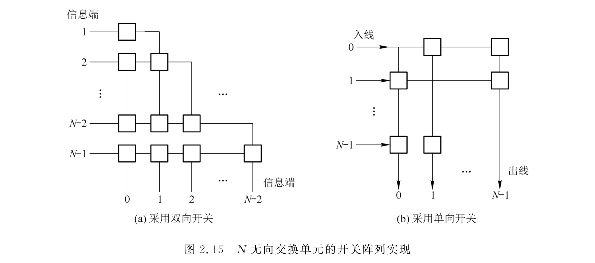

* M*N无向

需要$M \times N$个双向开关，或者$2 \times M \times N$个单向开关。

#### 开关阵列性质

* 空分交换。
* 容易实现同发和广播。
* 信息从入线到出线具有均匀的单位延迟时间：信息从任一入线到任一出线经过的开关数是相等的，不存在时延抖动。
* 开关阵列的控制简单。
* 适用于构成较小规模的交换单元。

* 开关阵列的性能取决于所用的开关性能。（继电器、模拟电子开关、数字电子开关）

实际实现：

* 可用多路选择器。

* 可用2\*2交叉连接单元（crossbar）：可以避免出线冲突，但不支持同发。

### S接线器

* 构成：
	* 交叉点矩阵（开关阵列）。
	* 一组控制存储器（CM，Control Memory）。
	
* 功能：输入输出线之间的空间交换。

* 规格：
	* 一个S接线器所含控制存储器CM的数量=入（出）线数。（输入控制CM数=入线数，反之）
	* 每个控制存储器CM含有的存储单元个数=时隙数。
	* 每个存储单元中存储索引存储单元的地址，为m位bit，且满足$N \le 2^m$，其中 N 为接线器的入（出）线数。
	
* CM 具有输入控制方式与输出控制方式。
	* **输入控制：控制一条输入线与每一条输出线的交叉点的开启与闭合，存储单元的内容表示对应输入复用线与哪一个输出复用线的交叉点开关在该存储单元所对应的时隙内接通**（对于入线$a$，在当前时隙$TS_i$，从$CM_a$的$i$号存储单元读出需要交换到的出线$b$，打开输入线$a$与$b$相交叉的开关，完成空间交换）
	* **输出控制：控制一条输出线与每一条输入线的交叉点的开启与闭合，存储单元的内容表示对应输出复用线上哪个交叉点在该存储单元所对应的时隙内接通**（对于入线$a$，在当前时隙$TS_i$，从$CM_a$）

特性：

* 只完成空间交换，不进行时隙交换。
* 空间接线器按时分方式工作。
* 输<u>出</u>控制方式易于实现多播（将多个CM的$TS_i$的存储单元置为同一条输入线即可）。
* 输出控制方式可自动避免出线冲突。

### T接线器

时分交换单元一般分为：共享存储器型交换单元、共享总线型交换单元。

* 共享存储器型：共 2N 个出入线缓存。入线缓存控制读出、出线缓存控制写入。

* 共享总线型：总线按照时隙轮流分配给入线控制部件和出线控制部件使用。
	* $kNV=B/T$（N 为入线数、V 为入线速率、B 为每时隙传送比特数、T 为时隙长度，k 为时隙分配因子）

时间接线器的构成

* T 接线器
	* 话音存储器（SM，Speech Memory）：暂存话音的数字编码信息
		* 存储单元个数等于 PCM 线路每帧时隙数；每单元至少 8bit（一路话音）
	* 控制存储器（CM，Control Memory）
		* 存储单元个数等于SM；每单元至少$log_2n（n 为时隙数）$比特

时间接线器输出控制方式：顺序写入、控制读出

* SM：前半周期顺序写入话音、后半周期从地址读出话音

* CM：前半周期顺序写入控制地址、后半周期控制读出话音

	缺点：复用级别越高，对控制电路要求越高，无法达成很大规模；时隙转换延迟不定。

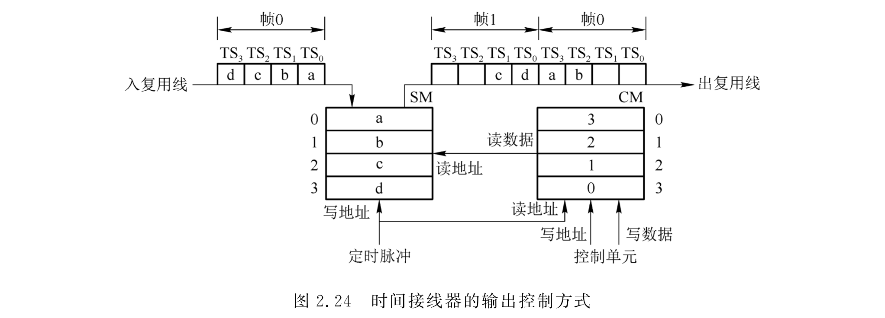

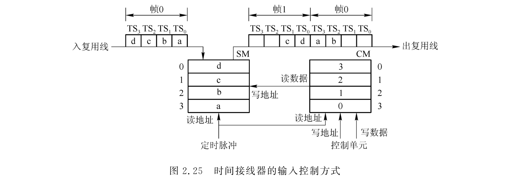

特性：

* 时分交换，用于交换同步时分复用的信号。
* SM划分为N个区域，每个区域一个字节，存放一个话音数据。各个区域间不共享，无排队缓冲。
* 交换的控制过程由CM硬件实现，速度快。
* 交换时延小且稳定。
* 严格无阻塞，并且可避免出线冲突。
* 易于实现同发和广播。
* 速率固定。

## 无阻塞网络概念

严格无阻：只要需要交换的入线与出线空闲，就可以通过交换网络建立一个连接。

可重排无阻：只要需要交换的入线与出线空闲，就可以通过交换网络直接地或对已有连接进行重排之后建立一个连接。

广义无阻：存在一种精巧的选路方法，使得只要需要交换的入线与出线空闲，**不必重排**，就可以通过交换网络建立连接。

## 交换网络的分类与特性

* 单级网络、多级网络：需要交换的信息从交换网络入线到出线仅经过n个交换单元，并且同一级中不同交换单元的入线和出线之间可以建立连接（交换单元需要发挥交换作用而非直连），则称为n级交换网络。
* 有阻塞网络、无阻塞网络：见上一小节。
* 单通道网络、多通道网络：任一条入线和出线之间只存在唯一的一条通路，则为单通道网络。
* 出线冲突：多个入线同时需要交换到同一出线上。
* 内部阻塞：出、入线空闲，但因交换网络级间链路被占用而无法接通的现象，称为多级交换网络的内部阻塞。

### CLOS网络：严格无阻、可重排无阻公式和构造

3级CLOS严格无阻：$r_2 \ge M+N-1$

3级CLOS可重排无阻：$r_2 \ge \max(M,N)$

构造法：根据要求确定中间级个数$m$，一三级分别采用$n \times m$和$m \times n$交换单元，$r=N \div n$，中间级采用$r \times r$交换单元。

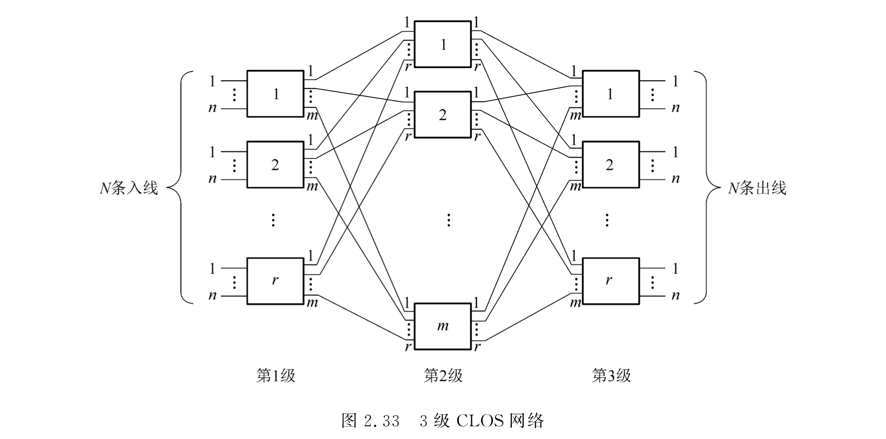

### TST：结构、SM和CM容量和内容、反向半帧、同发特性

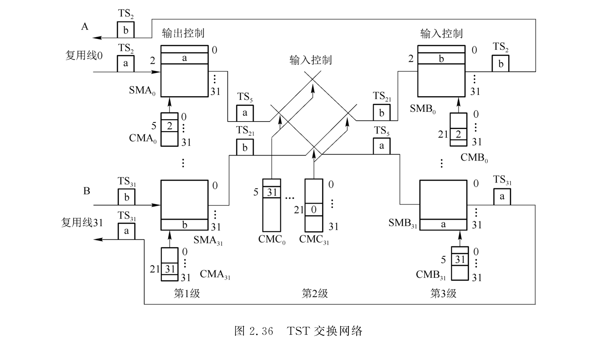

内部阻塞：存在，但概率很小，约为$10^{-6}$。

同发特性：不会。

### BANYAN网络

特性：唯一路径、有阻塞（内部竞争）、基于树形结构所以能自选路。

构造法：构造$N \times N$的BANYAN网络，需要$log_2N$级，每级$N/2$个交换单元。拿两个$n \times n$网络，将$n$个$2\times 2$交换单元作为一级通过混洗连接到前部、或者通过反转混洗连接到尾部。

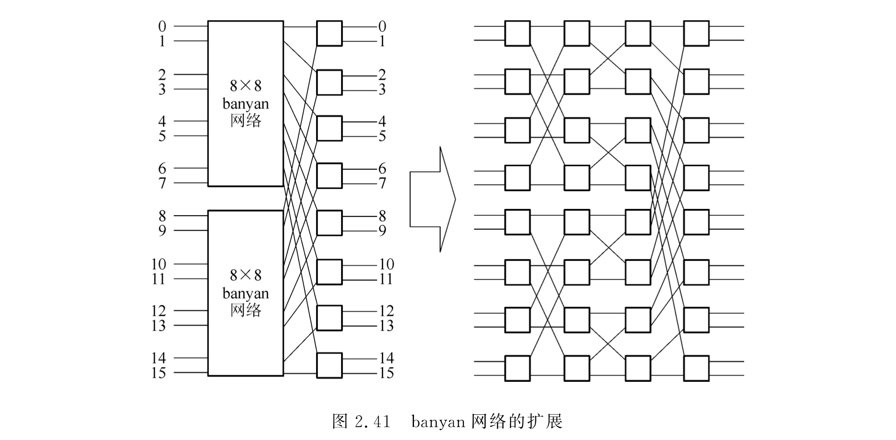

降低阻塞方法：

* 增加网络级数（如BENES网络），每增加一级，通路数翻倍。但同时失去唯一路径和自选路特性。
* 使用扩展型或膨胀型banyan网络。
* batcher-banyan（排序-banyan）网络：严格无阻塞、结构规整、自动选路。
* 减少入线的信息量，加大入线缓存。
* 增加平面数，构造多通道交换网络。

### BENES网络

两个banyan网络背靠背连接，并将中间两级合并为一级。是可重排无阻塞网络。

# 三	电话交换系统

## 程控数字交换机的结构

* 用户模块——远端用户模块/母局模块

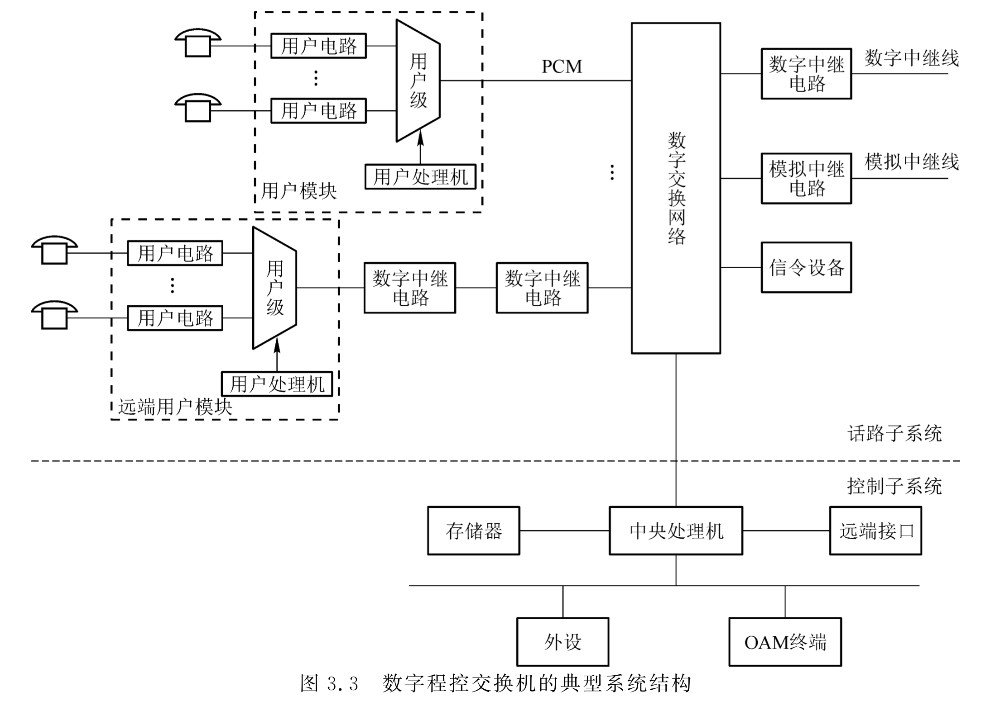

## 用户模块的基本功能

用户模块：

* 用户电路：每条用户线有一个用户电路，完成信号采集、动作驱动、话音传输等功能。
* 交换电路：用户级交换和话务集中（集中比为2：1或4：1）。
* 收号器：接收用户的DTMF号码。
* 扫描存储器：接收各个用户电路的扫描信息，送用户处理机。
* 分配存储器：接收用户处理机对各个用户电路的指令，控制各用户电路继电器的动作。
* 用户处理机：与中央处理机协调控制用户电路和交换电路的工作。
* 通信电路（信号提取插入）：负责收发用户处理机与中央处理机之间通信的信息。
* 网络接口：负责把用户的话音和处理机来的消息合并在一起，送到中央级的数字交换网络。

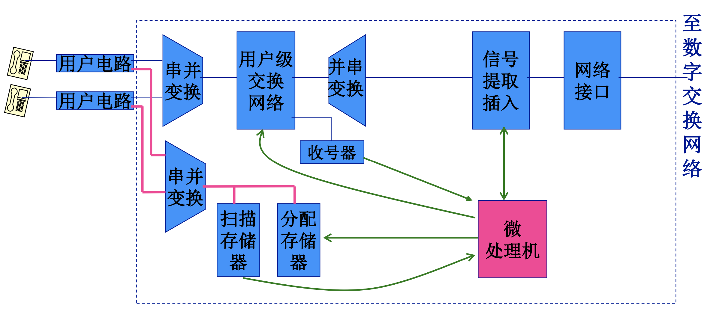

用户电路功能：BORSCHT

* 馈电（Battery feeding）：向用户提供直流馈电电流，电压-48V。
* 过压保护（Overvoltage protection）：二极管用于钳制电压，无论外线电压高于或低于内线，都会由二极管钳制内线为-48V，R 为热敏电阻，可自行烧毁。
* 振铃控制（Ring control）：控制是否向用户线发送25Hz铃流信号。
* 监视（Supervision）：监视用户环路的通断状态，通过电阻的直流压降得知用户是否摘机。
* 编译码和滤波（CODEC&filters）：模拟话音信号与64Kbps数字话音信号转换。对模拟信号进行编码、对数字信号进行解码；为避免混叠失真、50Hz 干扰、3400Hz 以上频率分量，进行滤波。
* 混合电路（Hybrid circuit）：在用户话机的 2 线双向信号和 PCM 的 4 线单向信号之间进行 2/4 转换。（发生在编码之前和译码之后）
* 测试（Test）：控制是否进行内外线的故障检测。

数字中继电路（连接远端用户模块使用）：

* 内部 NRZ 码与外部 HDB3 码之间的转换
* 时钟提取和同步（位同步、帧同步、复帧同步）
* 信令的插入提取

## 数字交换网络

* TST大题，全程话路连接

T接线器，串并复用与分路并串的时隙换算：

* 总共有$m$条 HW，第$i$条 HW 上 $TS_j$的 ITS 号 =$j \times m + i$。

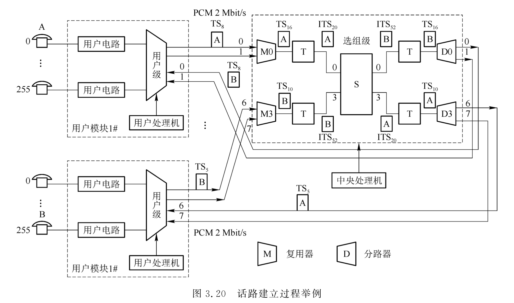

话路建立：

* 用户 A 呼叫用户 B：用户级出线$HW_0TS_{8}$经过复用器$M_0$交换为$ITS_{16=2*8+0}$，选择交换时隙$ITS_{20}$；
* 用户 B 建立到用户 A 的连接：采用反向法（半帧法）计算，由$ITS_{20}$，T 接线器输入信号每帧为 64 时隙（由两条PCM32线路复用而来），半帧为 32，故 20+32=52，所以 B 到 A 的连接选择$ITS_{52}$。

完整版：

* 每个用户模块连接**256**个用户，内部提供**8**条**HW**，**32TS/HW**

	(即**256\*256**)的交换

* 所有模块(包括用户模块**/**中继模块**/**信号音源)连接到**TST**的中央交换网络，支持**16K\*16K**的交换(每个**T**支持**512\*512** 交换)。用户模块采用复接方式接入**TST(A**为复接点**)**，实现话务集中

* 用户**A**接至模块**0**的**HW0TS1**，用户**B**接至模块**n**的**HW7TS31** (双向都使用该时隙)

* 系统为用户**A**选择模块**0**的空闲时隙**HW0TS3**(双向)，模块**0**的**HW0**固定连接到**M0**的**HW0**;为用户**B**选择模块**n** 的空闲时隙**HW3TS8**(双向)，模块**n**的**HW3**固定连接到**M31**的 **HW8**

* **A**→**B**连接时，**TST**网络选择使用内部时隙**ITS4**；**B**→**A**连接时， 使用反相法选择内部时隙

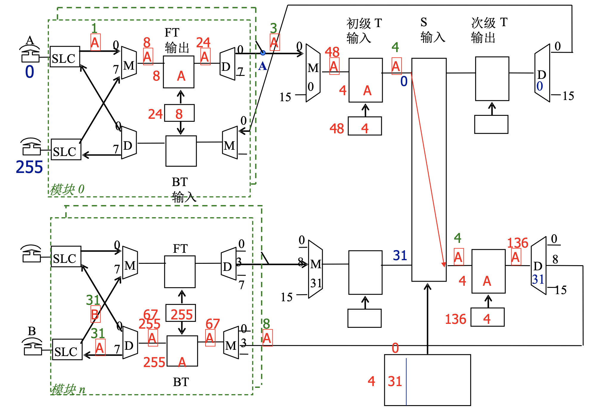

## 控制部分（概念掌握）

控制方式：

* 集中控制：处理机对交换系统内所有功能及资源统一控制。
	* 处理机直接控制所有功能的完成和资源的使用，因此控制关系简单，处理机间通信接口简单。
	* 单个处理机上的应用软件复杂、庞大。
	* 一旦处理机系统故障，整个控制系统失效。可靠性较低。
* 分级分散控制：控制系统由多个处理机构成，分别完成不同功能并对不同资源实施控制。
	* 处理机之间分等级，高级别处理机控制低级别处理机。
	* 处理机之间通信接口较为集中，控制方式复杂，但比全分散简单。
	* 各处理机上应用软件复杂程度适中。
	* 控制系统的可靠性适中。
* 全分散控制：各个处理机之间独立工作，分别完成不同功能并对不同资源实施控制。
	* 处理机之间不分等级，不存在控制与被控制关系。
	* 每台处理机只完成部分功能，要求各处理机协调配合完成整个系统功能，通信接口复杂。
	* 每台处理机应用软件只完成该处理机承担的功能，较为简单。
	* 可靠性较高。
	* 系统具有良好的扩充能力。

多处理机之间的工作分担方式：

* 功能分担：多个处理机分别完成同一话务的不同功能。
* 负荷（话务）分担：多个处理机各自完成一部分话务功能。

多处理机的可靠性（冗余方式）：

* 双机冗余配置：两套处理机系统，一个主用、一个备用。
	* 同步方式：主备用机同步工作，同时执行指令并比较结果。
	* 互助方式：主备用机负荷均分，分别承担一半话务负荷。一台机器故障，负荷全部转移到另一台机器上。
	* 主备用方式：主机在线运行，备用机处于待机状态。（冷备用：不保存动态呼叫数据，故障切换时直接呼损。热备用：保存动态呼叫数据，故障切换时不会呼损。一般采用热备用。）

* N+m备份：N个处理机在线运行，m个处理机处于备用状态。

## 程控数字交换机的软件

SDL图：

### 呼叫处理

呼叫处理：

* 输入处理、摘挂机检测（重点）
* 分析处理
* 输出处理

本局呼叫处理：

**摘挂机检测（重点）**

### 任务分级和调度

任务分级：

* 级间转移：级别高的程序优先处理。

| 程序级别 | 程序功能                       | 启动方式 | 响应速度         |
| -------- | ------------------------------ | -------- | ---------------- |
| 故障级   | 故障识别和紧急处理             | 硬件中断 | 立即响应         |
| 周期级   | 按一定周期进行的各种扫描和驱动 | 时钟中断 | 在严格时限内相应 |
| 基本级   | 分析处理和各种无时限任务       | 事件队列 | 在一定时限内相应 |

时间表调度算法：

* 每次时间中断到来时，对时间计数器加一，根据时间计数器的值形成时间表行地址。屏蔽表用于控制在该时刻程序是否被调用执行。

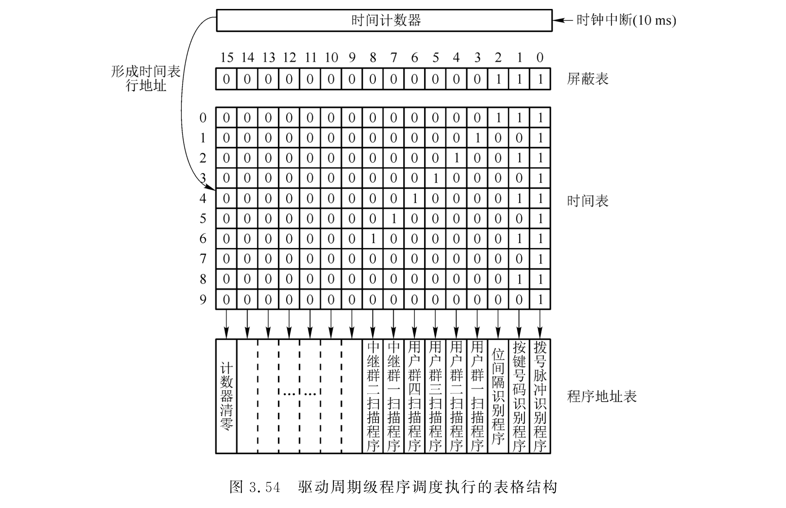

### BHCA计算

BHCA（maximum number of Busy Hour Call Attempts，最大忙时试呼次数）

* 处理机的系统开销=固有开销（与呼叫处理次数无关）+非固有开销（与呼叫处理次数有关）
* BHCA计算：$t=a+bN$，t为总开销时间，a为固有开销，b为处理一次呼叫的平均非固有开销，N为单位时间内处理呼叫总次数。

# 四	分组交换

## 路由器的交换结构

* 高端路由器的CLOS结构（了解概念）

## MPLS概念

> 特点：面向连接（VPC/VCC）、多协议、标签交换
>
> 边缘路由、核心交换
>
> LER、LSR、FEC、LIB、LSP概念

* MPLS在多种第二层协议上进行标记交换，将第二层和第三层有机结合。

* 核心思想：**边缘路由，核心交换**：边缘路由保持与现有协议兼容，增强核心网络交换速度。

概念：

* LSP：Label Switched Path标记交换路径，类似虚电路。
* FEC：Forward Equivalence Class前转等价类，灵活按照多种方式划分，相同FEC的包具有相同Label，走相同LSP。
* LIB：Label Information Base标记信息库，保存转发Labeled分组所需要的信息。
* Ingress LER：Ingress Label Edge Router入口边缘路由器，为每个FEC生成Label，映射到LSP下一跳的标记。对入口IP分组进行分类，确定FEC。
* LER：根据FEC查询LIB得到下一跳Label，将Label插入IP包头，从相应端口发送。
* LSR：Label Switch Router，维护LIB、完成标记置换。
* Egress LER：去掉Label还原成普通IP包继续转发。

主要特点：

* 标记置换：将2层的交换速度带到3层
* 控制平面与转发平面分离：便于采用新的路由协议和交换技术
* 通过标记堆栈实现多层次的转发：提高可扩展性

对比：

## MPLS交换原理

LDP标签分配过程：
* 发现相邻的LDP对等体：使用UDP广播，发现相邻LSR
* 建立LDP会话：相邻LSR建立TCP连接，建立LDP会话
* 建立LSP：下游LSR分配标记并沿着LDP会话通知上游LSR

标签操作：

* Push：标签入栈，进入子路由域内传输。
* Pop：标签出栈，回到父路由域传输。
* Replace：置换标签，在同一路由域内传输。

# 五	信令系统

定义：各个设备间传输的控制信号和规约称为信令。

## 七号信令

> * 协议栈：
> 	* MTP部分各级功能
> 	* UP部分
> 		* TUP的基本信令流程（IAM、ACM、ANC、CLF、RLG）
> 	* 信令消息的传递涉及的协议栈
> * 我国的信令网结构
> 	* HSTP、LSTP、SP结构、连接方案
> * 信令点编码
> 	* 国际14bits
> 	* 我国24bits
> 		* 主信令区、分信令区、信令点
>

### 七号信令网结构

国内信令点编码：24bits

| HSTP高级信令转接点 | LSTP低级信令转接点 | SP信令点 |
| ------------------ | ------------------ | -------- |
| 8bit               | 8bit               | 8bit     |

国际信令网的信令点编码：14bits（大区和SP变为3bit）

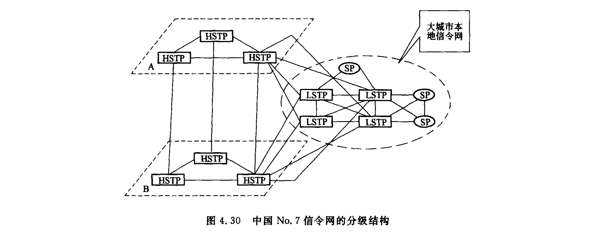

### 七号信令协议栈结构

* MTP：消息传递部分（重点）
	* MTP1——物理层
	* MTP2——数据链路层
	* MTP3——网络层一部分
* SCCP：信令连接控制部分——网络层一部分
* UP：用户部分——传输层、会话层、表示层、应用层
	* ISUP：综合业务数字网部分
	* TUP：电话用户部分（重点）
	* DUP：数据用户部分
	* TCAP：事务处理能力部分
		* INAP：智能网应用部分
		* OMAP：操作维护应用部分
		* MAP：移动通信应用部分

MTP各级功能：

| OSI对应      | MTP部分              | 功能                                                         |
| ------------ | -------------------- | ------------------------------------------------------------ |
| 物理层       | MTP1：信令数据链路级 | 规定信令链路电气特性和接入方法。速率64Kbps。                 |
| 数据链路层   | MTP2：信令链路功能级 | 将第一级中透明传输的比特流划分为不同长度的信令单元，有差错检测和重发校正。 |
| 网络层的部分 | MTP3：信令网功能级   | 保证信令单元在网络中的可靠传输。                             |

TUP功能：规定电话呼叫的建立和释放的信令流程，以及实现这些流程的消息和消息编码。并能支持部分用户补充业务。提供电话呼叫的控制信令，完成电话呼叫续接和控制。

* 处理SIF字段中的CIC、H0H1、信令信息。
* 呼叫信令：

| 消息类型 | 含义                                   |
| -------- | -------------------------------------- |
| IAM      | 初始地址消息                           |
| ACM      | 地址全消息，表示被叫空闲，呼叫建立成功 |
| ANC      | 被叫应答、计费消息                     |
| CLF      | 前向释放                               |
| CBK      | 后向释放                               |
| RLG      | 正常呼叫结束时电路释放监护消息         |
|          |                                        |
| SLB      | 市话忙                                 |
| STB      | 长话忙                                 |
| CGC      | 电路群拥塞                             |
| SEC      | 交换机拥塞                             |

### 七号信令单元格式

三种信令单元：

* 消息信令单元MSU（Message Signaling Unit）：运载高层（用户部分或信令网管理功能）产生的信令消息。

* 链路状态信令单元LSSU（Link State Signaling Unit）：用来传送链路状态信息。

* 插入信令单元FISU（Filled-In Signaling Unit）：在无MSU和LSSU时发送。

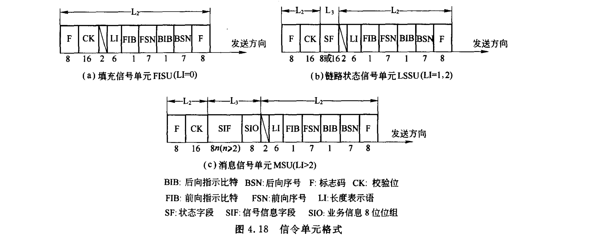

* MSU信令的SIF信息字段中开始位置是路由标记（Routing Label），分为：

	* DPC：目的信令点编码
	* OPC：源信令点编码
	* SLS：信令链路选择码

	路由标记供MTP3级进行消息寻址和路由。国内的信令点编码24bits，国际14bits。

* 电话用户部分TUP处理MSU信令中SIF子段的CIC、H0H1、信令信息：

	* CIC标记话路时隙
	* H0H1是标题码
	* 信令信息传递消息参数

### 信令消息的传递

* 直联工作方式：SP和SP之间的信令消息通过直接相连的信令链路传送。
* 准直联工作方式：SP和SP之间的信令消息通过（STP转发）预先指定的多条串接的信令链路传送。
* 非直连工作方式：不预先指定，随机转发（复杂，No.7未采用）

准直联方式下信令信息的传递方式：

## SIP信令

SIP（Session Initiation Protocol）会话发起协议是一种IP电话信令协议。

基本特点：

* **应用层**控制协议，独立于底层协议。用于建立、修改和中止IP网上的双方或多方多媒体会话。
* 基于文本的消息编码，使用UTF-8字符集，易于读取和调试。
* 具有多个层次的可实现性，最小的实现非常简单、最完全的实现能够完成非常多的功能。
* 通过代理、重定向功能支持用户的移动性。
* 可与RTP/RTCP、SDP、RTSP、DNS等协议配合。易于实现和扩展。

SIP系统中各网元（用户代理、代理服务器、注册服务器）作用：

* 用户代理（User Agent）：终端用户设备，用于创建和管理SIP会话的设备。UA发出消息，代理服务器对消息进行响应。
* 代理服务器：接收UA的会话请求并查询SIP注册服务器，获取收件方UA的地址信息。然后，根据收件方域的位置，将会话邀请转发给收件方UA或代理服务器。
* 注册服务器：包含域中所有用户代理的位置的数据库。在SIP通信中，注册服务器会检索参与方的IP地址和其它相关信息，并将其发送到代理服务器。

* SIP消息：register、invite、100trying、180ringing、200ok、ack、bye等
* SIP地址与端口
* SDP媒体协商的重点内容

# 六	移动交换

## 移动通信的基本概念

入网、鉴权、切换、漫游、位置更新、网络附着

## GSM、GPRS的基本网络结构及网元功能

* GSM网络结构、网元功能
* GSM网络信令基本过程（始呼、寻呼、切换）
* GPRS网络结构、网元功能
* 电路域、分组域

## 3G通信

* 网络结构演进过程（了解）
* 交换方式：电路+分组——全分组

## 4G通信

* 网元结构和功能（了解）
* 交换方式：全IP

# 七	NGN与SDN

## 软交换的系统结构、四层结构

* 软交换技术特征

	* 业务处理与呼叫控制分离
	* 呼叫处理与承载分离

* 四层体系结构、各层典型设备

	* 媒体网关、信令网关、接入网关、软交换机、MPLS路由器、应用服务器

## IMS特点

* 全SIP信令
* 业务处理与呼叫控制分离
* 呼叫处理与承载分离
* 呼叫控制与媒体控制分离

## SDN

* 与传统IP网络的区别——控制平面、转发平面分离
* 转发、控制、应用的三层架构 与 南北向接口
* Openflow基本概念
* 流表的作用、与路由表的区别

​	