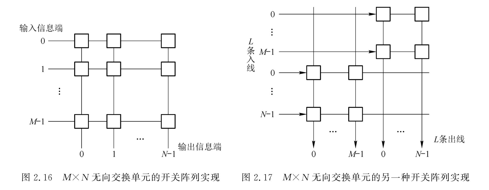

# 一	概论

## 交换的概念

在通信网上，在通信源点和目的点之间建立通信通道，并传送信息的机制。

## 通信网（三要素）

#### 交换设备

包括各类交换机和交叉连接设备。

#### 传输设备

包括用户线路、中继线路、信号转换设备。（如：双绞线、电缆、光缆、基站无线收发设备、光电转换器、卫星、微波等）

#### 终端设备

包括电话机、智能终端、智能外设等用户终端设备。

## 交换方式的特点

### 电路交换

电话通信中信息的传送方式：**公共交换电话网（Public Switched Telephone Network，PSTN）**，每一路能提供64k速率。

电路交换的特点

* 信息传送的最小单位是时隙：每个时隙采样8bit，采样率8kHz，每路通信速率64kbps。

* 面向连接的工作方式（物理连接）。
* 同步时分复用（固定带宽分配）。
* 无差错控制机制（实时性强）。
* 对通信信息不作处理（透明传输）。
* 流量控制基于呼叫损失制。

适合实时性、恒定速率的业务。

### 分组交换

机制——存储+转发。

分组交换的特点：

* 信息传送的最小单位是分组：由分组头、用户信息构成，分组头含有选路和控制信息。
* 面向连接（虚电路）方式和无连接（数据报）方式。
* 统计时分复用，动态分配带宽。
* 有差错控制机制：CRC校验、重发等（设于第二层和第三层协议中）。
* 信息传送不具有透明性：对通信信息作处理，如拆分、重组等。
* 流量控制基于呼叫延迟制。

适用于突发、对差错敏感的数据业务。

|            | 虚电路             | 数据报                 |
| ---------- | ------------------ | ---------------------- |
| 分组头     | 简单（逻辑信道号） | 复杂（详细的选路信息） |
| 选路       | 虚连接表           | 每个分组独立选路       |
| 分组顺序   | 有序               | 可能失序               |
| 故障敏感性 | 敏感               | 可靠性高               |
| 应用       | 连续数据流         | 询问/响应              |

### 各类交换方式的基本信息交换单元

| 交换类型 | 基本信息交换单元 |
| -------- | ---------------- |
| 电路交换 | 时隙             |
| 报文交换 | 报文             |
| 分组交换 | 分组             |
| 帧中继   | 帧               |
| ATM交换  | 信元             |

## 复用技术

### 同步时分复用

* 用于电路交换。
* 采用位置化信道：
	* 根据数字信号在**时间轴**上的位置区别各路。无信息传送时，也会占用信道。
	* 每帧定长。
	* 信号经过复用器和分路器的时延低（1~2帧）。

### 统计时分复用

分为分组化时分复用、异步时分复用。

* 用于分组交换、ATM交换。

* 采用标志化信道：使用分组头的标志区分各路通信。

#### 分组化时分复用

* 每个分组前附加标志码，标识分组的输出端或传送路径，与时间无关。
* 分组长度可变、分组头定界。
* 统计复用提高信道利用率。具有一定容量的排队存贮器，解决瞬间的出线冲突。
* 传输时延较小且稳定、处理时延与分组大小有关、排队时延与突发流量有关。

#### 异步时分复用

* 位置固定的标志化信道。
* 信元长度固定、插入空信元保持同步。
* 时延较为稳定。

## 连接类型

### 面向连接/无连接

面向连接：

* 无论物理或逻辑连接，通信分为三阶段：连接建立、传送信息、连接拆除。
* 连接建立后，传送的所有信息均沿此路径传送，保证信息有序性。
* 信息传送的时延（比无连接）小。
* 对网络故障敏感。

无连接：

* 没有连接建立过程，边选路边传送。
* 同一通信的信息到达目的地的路径无法预知，不保证信息有序性。
* 信息传送的时延（比面向连接）大。
* 对网络故障不敏感。

### 物理连接/逻辑连接（虚电路）

同：都具有连接建立、传送信息、连接拆除三阶段。

异：物理连接建立一条通信源和目的之间的物理连接通路；逻辑连接没有物理连接，通过在通信连接上的所有交换节点保存选路结果和路由连接关系实现逻辑上的连接。

## 带宽分配

### 固定带宽分配

### 动态带宽分配

见“复用技术”。

## \*交换技术的种类和特点

## \*各种常用网络的交换方式

## \*各种常用网络的重要信令/协议

## \*电信交换系统的基本结构

由信息传送子系统和控制子系统组成。

* 信息传送子系统：
	* 交换网络：完成交换，实现任意出线与入线的互联。
	* 各种接口：分为用户接口和中继接口，用途是进行信号转换。
* 控制子系统：由处理机系统构成，是交换系统的“指挥中心”。

# 二	交换网络

## 连接概念

交换单元的基本功能是在入线和出线之间建立一定的链接，是信息能从入线交换到出线。连接特性反应交换单元的连接能力。

### 连接

* 集合描述法：所有入线序号为集合$T$，出线序号为集合$R$。连接$c = \{t,R_t\}, t \in T , R_t \subset R$
* 函数描述法：$f(t)=R_t,\space R_t \subset R$
* 排列表达式：（笑死，LaTeX根本学不会），入线排列表达式$(0,1,2...,N-2,N-1)$
* 图形表示法：略
* 二进制函数表示：$E(x_{n-1}x_{n-2}...x_1x_0)=x_{n-1}x_{n-2}...x_1\bar{x_0}$，表示点到点二进制编号。

一个$N \times N$的交换单元最多可以有$N!$种不同的点到点连接方式。

### 连接方式

* 直线连接：略

* 交叉连接（交换置换）：$(1,0,3,2,...,N-1,N-2)$，$E(x_{n-1}x_{n-2}...x_1x_0)=x_{n-1}x_{n-2}...x_1\bar{x_0}$

* 蝶式连接：$\beta (x_{n-1}x_{n-2}...x_1x_0)=x_0x_{n-2}...x_1x_{n-1}$，将输入端二进制最高位$x_{n-1}$与最低位$x_0$互换位置得到。

* 均匀洗牌置换：将入线均分，前一部分和后一部分按顺序一个接一个交叉连接。$\delta(x_{n-1}x_{n-2}...x_1x_0)=x_{n-2}x_{n-3}...x_1x_0x_{n-1}$，将入线二进制地址循环左移一位得到。
* 间隔交叉连接（方体置换）：实现二进制地址编号中第k为位置不同的输入端和输出端之间的连接。

不会真有人记得住这些吧？

----

### 点对点、同发、广播

对于连接$c = \{t,R_t\}, (t \in T , R_t \subset R)$

* 如果$R_t$只有唯一元素，为点到点连接。

* 如果$R_t$包含多个元素，为点到多点连接。
	* 如果$R_t \ne R$，为同发。
	* 如果$R_t = R$，为广播。

## 交换单元的结构、特性、工作原理

基本交换单元的结构、特性（需要的单元个数、是否内部阻塞、同发和广播能力）

### 基本交换单元与开关阵列

#### M*N有向

采用矩阵表示开关通断：

$$
\begin{pmatrix}
1 && 0 && \cdots && 0 \\
0 && 0 && \cdots && 1 \\
\vdots && \vdots && \ddots && \vdots \\
0 && 1 && \cdots && 0
\end{pmatrix}
$$

**不允许出线冲突时，同column只允许一个1出现；不允许同发广播时，同row只允许一个1出现。**

#### N无向

特点是主对角线不连通。需要$N(N-1)/2$个双向开关，或者$N(N-1)$个单向开关。

#### M*N无向

需要$M \times N$个双向开关，或者$2 \times M \times N$个单向开关。

#### 性质

空分交换；开关数量$M \times N$；容易实现同发和广播；性能取决于所用交换单元；无内部阻塞；均匀的单位延迟时间。

实际实现：

* 可用多路选择器。

* 可用2\*2交叉连接单元（crossbar）：可以避免出线冲突，但不支持同发。

T接线器工作原理

S接线器工作原理

## 无阻塞网络概念

严格无阻、可重排无阻、广义无阻

## 交换网络

单级网络、多级网络

单通道网络、多通道网络

出现冲突、内部阻塞

CLOS网络：严格无阻、可重排无阻和公式和构造

T、S组合：结构、SM和CM容量和内容、反向半帧、同发特性

BANYAN网络：特性（唯一路径、有阻塞）、构造法、降低阻塞方法

BENES网络

# 三	电话交换

## 程控数字交换机的结构

* 用户模块——远端用户模块/母局模块

## 用户模块的基本功能

## 数字交换网络

* TST大题，全程话路连接

## 控制部分

* 控制：集中控制、分级控制、全分散控制（概念掌握）
* 分担：功能分担、负荷分担
* 可靠性：同步方式、互助方式、主备用方式、N+m备份

## 程控数字交换机的软件

* SDL图
* 呼叫处理：
	* 输入处理、摘挂机检测（重点）
	* 分析处理
	* 输出处理
* 任务分级和调度
	* 故障级、基本级、周期级
	* 时间表调度算法
* BHCA计算

# 四	分组交换

## 路由器的交换结构

* 高端路由器的CLOS结构（了解概念）

## MPLS概念

* 特点：面向连接、多协议、标签交换
* 边缘路由、核心交换
* LER、LSR、FEC、LIB、LSP概念

## MPLS交换原理

* 标签操作：Push、Pop、Replace
* LDP标签分配和数据传输过程（下游按需分配）

# 五	信令系统

## 七号信令

* 协议栈：
	* MTP部分各级功能
	* UP部分
		* TUP的基本信令流程（IAM、ACM、ANC、CLF、RLG）（那张图）
	* 信令消息的传递涉及的协议栈（直联和间接直联那张图）
* 我国的信令网结构
	* HSTP、LSTP、SP结构、连接方案（课本上那张图）
* 信令点编码
	* 国际14bits
	* 我国24bits
		* 主信令区、分信令区、信令点

## SIP信令

* 基本特点
* SIP系统中各网元（用户代理、代理服务器、注册服务器）作用
* SIP消息：register、invite、100trying、180ringing、200ok、ack、bye等
* SIP地址与端口
* SDP媒体协商的重点内容

# 六	移动交换

## 移动通信的基本概念

入网、鉴权、切换、漫游、位置更新、网络附着

## GSM、GPRS的基本网络结构及网元功能

* GSM网络结构、网元功能
* GSM网络信令基本过程（始呼、寻呼、切换）
* GPRS网络结构、网元功能
* 电路域、分组域

## 3G通信

* 网络结构演进过程（了解）
* 交换方式：电路+分组——全分组

## 4G通信

* 网元结构和功能（了解）
* 交换方式：全IP

# 七	NGN与SDN

## 软交换的系统结构、四层结构

* 软交换技术特征

	* 业务处理与呼叫控制分离
	* 呼叫处理与承载分离

* 四层体系结构、各层典型设备

	* 媒体网关、信令网关、接入网关、软交换机、MPLS路由器、应用服务器

## IMS特点

* 全SIP信令
* 业务处理与呼叫控制分离
* 呼叫处理与承载分离
* 呼叫控制与媒体控制分离

## SDN

* 与传统IP网络的区别——控制平面、转发平面分离
* 转发、控制、应用的三层架构 与 南北向接口
* Openflow基本概念
* 流表的作用、与路由表的区别

​	